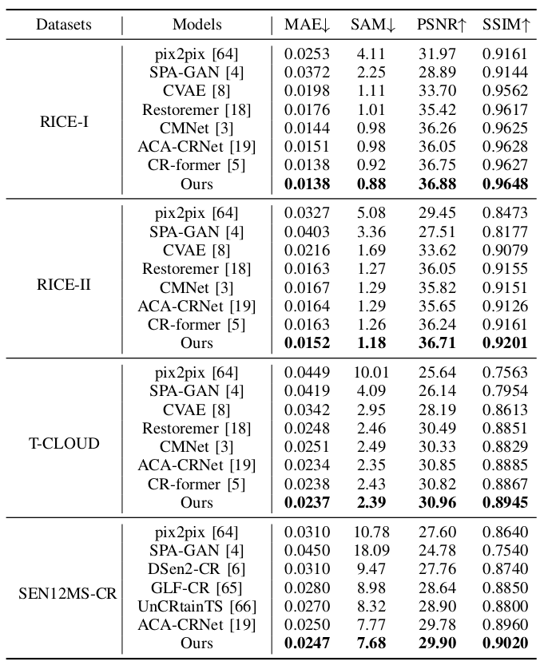

# DVPNet: Dual-view Prompting for Cloud Removal

Ye Deng, Member, IEEE, Wenli Huang, ZiXin Tang and Jiang Duan, "Dual-view Prompting for Cloud Removal", 2025

<!-- <!-- #### 🔥🔥🔥 News -->

- **2025-08-25:** Readme and config are released. 🎊🎊🎊 
- **2025-09-25:** ** DVPNet Network. 🎊🎊🎊 
- **2025-09-25:** ** pretrain-models. 🎊🎊🎊 

---

> **Abstract:** Cloud cover significantly impedes the utilization of remote sensing data, limiting the effectiveness of satellite imagery in critical applications such as environmental monitoring and disaster response. While deep learning methods have advanced cloud removal, existing models predominantly focus on spatial-domain feature discrepancies, often overlooking distinctive spectral difference introduced by clouds. To address this gap, we propose a Dual-view Prompting Network (DVPNet) that integrates spatial and frequency information via prompt learning to generate robust guidance features. The core innovation, the Dual-view Prompting Block (DVPB), operates cascadedly: first, a spatial gating module refines features to capture contextual cues; these features are then transformed
> into the Fourier domain, where a frequency-gating structure and a learnable spectral prompt further calibrate and enhance representations. The holistically refined dual-view prompt is integrated into the decoder through an efficient windowed cross-attention mechanism, enabling precise cloud removal. Extensive experiments on benchmark datasets demonstrate that DVPNet achieves state-of-the-art performance. This work validates the critical role of frequency-domain modeling in cloud removal and
> establishes a new spatial-frequency collaborative paradigm for remote sensing image restoration.


---


## ⚙️ Installation

- Python 3.9.0

- PyTorch 1.13.1

- NVIDIA GPU + [CUDA](https://developer.nvidia.com/cuda-downloads) 11.7

- Clone this repo:

  ```bash
  git clone https://github.com/huangwenwenlili/DVPNet.git
  cd DVPNet
  ```

- Create conda environment:

  ```bash
  conda env create -f DVPNet-env.yml -n CR-former
  conda activate DVPNet 
  ```


## 🔗 Contents

1. [Datasets](#datasets)
1. [Models](#models)
1. [Training](#training)
1. [Testing](#testing)
1. [Results](#results)
1. [Citation](#citation)
1. [Acknowledgements](#acknowledgements)

---


## <a name="datasets"></a>🖨️ Datasets
- ```RICE-I```: It consists of 500 pairs of filmy and cloud-free images obtained from Google Earth. 
[RICE-I](https://github.com/BUPTLdy/RICE_DATASET)
- ```RICE-II```: It consists of 736 pairs of images captured by Landsat 8 OLI/TIRS, including cloudy, cloudless, and mask images. The mask images were created using the Landsat Level-1 quality band to identify regions affected by clouds, cloud shadows, and cirrus clouds. The cloudless images were captured at the same location as the corresponding cloud images with a maximum interval of 15 days. [RICE-II](https://github.com/BUPTLdy/RICE_DATASET)
- ```T-CLOUD```: The T-CLOUD, a real scene thin cloud dataset captured from Landsat 8 RGB images, contains 2,939 image pairs. The cloudy images and their clear counterparts are separated by one satellite re-entry period (16 days). These images are carefully selected with similar lighting conditions and are cropped into $256 \times 256$ patches. The dataset is split into 2351 images for training and 588 for testing. 
[T-CLOUD](https://github.com/haidong-Ding/Cloud-Removal)
- `SEN12MS-CR`:It contains approximately 110,000 samples from 169 distinct, non-overlapping regions across various continents and meteorological seasons. Each sample includes a pair of Sentinel-2 images, one cloudy and one cloud-free, along with the corresponding Sentinel-1 synthetic aperture radar (SAR) image. [SEN12MS-CR](https://mediatum.ub.tum.de/1554803)


Download training and testing datasets and put them into the corresponding folders of `./datasets/`.


## <a name="models"></a>📦 Models

[Rice1 pretrained model Baidu Disk](https://pan.baidu.com/s/1fJgntXjA1NIDtcIBXJwEXA?pwd=w5ch)

[Rice2 pretrained  model Baidu Disk](https://pan.baidu.com/s/1fJgntXjA1NIDtcIBXJwEXA?pwd=w5ch)

[T-CLOUD pretrained model Baidu Disk](https://pan.baidu.com/s/1fJgntXjA1NIDtcIBXJwEXA?pwd=w5ch)


## <a name="training"></a>🔧 Training
- The training configuration is in folder `option/RICE1-CR-Former.yml`,  `option/RICE2-CR-Former.yml`, and `option/T-CLOUD-CR-Former.yml`.

    - The argument `dataroot_gt` in the `.yml` file specifies the path to the training dataset.
    - The argument `name` in the `.yml` file specifies the path to the training model (*.pth). By default, it is set to the `./experiments/name` folder.
    - The training experiments are stored in the `./experiments` directory.

- Run the following scripts for training
  ```shell
  # RICE1, input=256*256, 1 A100 GPU
  sh train_script/rice1.sh
  
  # RICE2, input=256*256, 1 A100 GPU
  sh train_script/rice2.sh

  # T-CLOUD, input=256*256, 1 A100 GPU
  sh train_script/t_cloud.sh
  ```
  ```
   - Set `-opt` as the model configuration option in the '.sh' command.
  ```

## <a name="testing"></a>🔨 Testing
- Download the pre-trained [models](https://pan.baidu.com/s/1fJgntXjA1NIDtcIBXJwEXA?pwd=w5ch) and place them in `./experiments` directory.

- Use RICE1, RICE2, and T-CLOUD testing datasets.

- Test the model. 
Run the following scripts for training
  ```shell
  # RICE1
  sh test_script/rice1_test.sh

  # RICE2
  sh test_script/rice2_test.sh

  # T-CLOUD
  sh test_script/t_cloud_test.sh
  ```
  ```
  - Set `--opt` as the model configuration option.
  - Set `--input_dir` as the input test dataset path.
  - Set `--input_truth_dir` as the input test dataset ground truth path.
  - Set `--result_dir` as output image path.
  - Set `--weights` as the pretrained-model path.
  - The default results will be saved under the *output* folder.
  ```

## <a name="results"></a>🔎 Results

We achieved state-of-the-art performance. Detailed results can be found in the paper.

<details>
<summary>Quantitative Comparison (click to expand)</summary>

- Quantitative comparison results on the four datasets in Table I of the main paper. Metrics marked with ↓ are better when lower, and those with ↑ are better when higher. Best results are shown in bold.

<p align="center">
  
</p>
</details>

<details>
<summary>Visual Comparison (click to expand)</summary>

- RICE2 results in Figure 1 of the main paper

<p align="center">
  
</p>


</details>


## <a name="citation"></a>📎 Citation

If you find the code helpful in your research or work, please cite the following paper(s).

```
@ARTICLE{wu2024cr,
	author={Ye Deng, Wenli Huang, ZiXin Tang and Jiang Duan},
	journal={IEEE Transactions on Geoscience and Remote Sensing}, 
	title={Dual-view Prompting for Cloud Removal}, 
	year={2025},
	volume={62},
	number={},
	pages={1-14}}
```

## License
<br />
The codes and the pre-trained models in this repository are under the MIT license as specified by the LICENSE file.
This code is for educational and academic research purpose only.

## <a name="acknowledgements"></a>💡 Acknowledgements

This code is built on [Restormer](https://github.com/swz30/Restormer). We thank the authors for sharing their codes.
